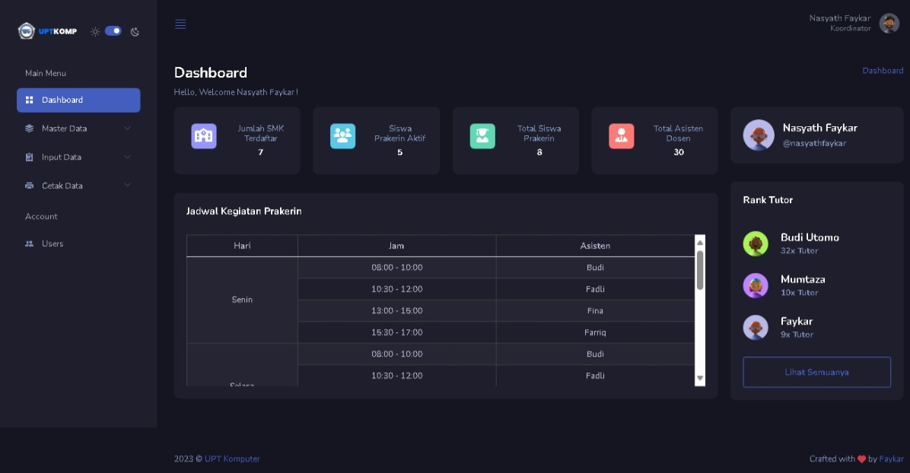
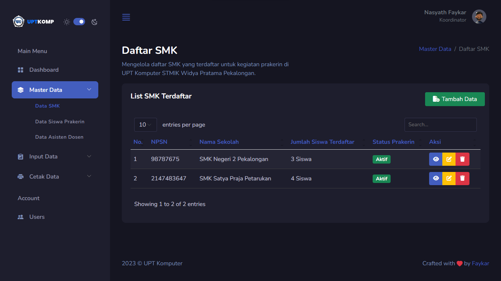
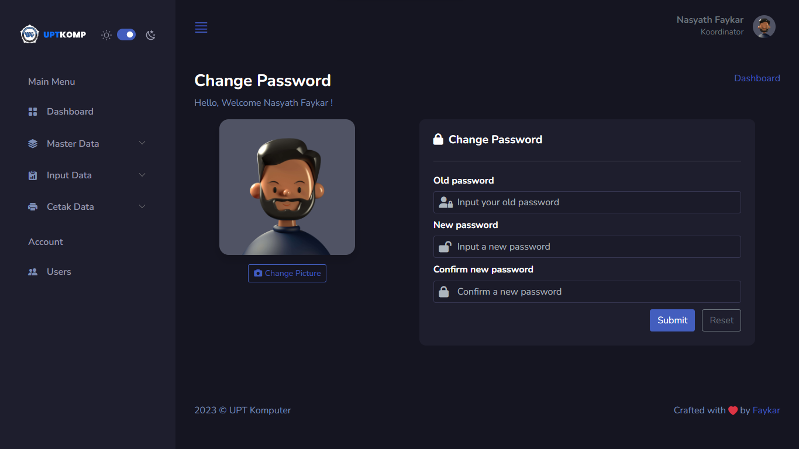
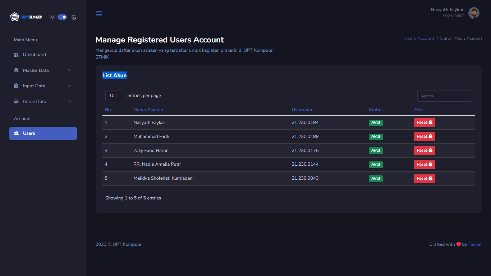

# SIP-Prakerin

<b>Sistem Informasi Prakerin</b>.
<br>
Repository ini berisi proyek SIP-Prakerin (Sistem Informasi Prakerin) yang dikembangkan untuk mempermudah proses manajemen kegiatan magang SMK di UPT Komputer, kampus STMIK Widya Pratama. Sistem ini bertujuan untuk meningkatkan efisiensi dalam mengelola informasi dan memfasilitasi koordinasi antara SMK dan UPT Komputer dalam pelaksanaan kegiatan prakerin.

## Teknologi yang digunakan:

<ul>
  <li> Bahasa Pemrograman : PHP </li>
  <li> Framework          : Codeigniter 4 </li>
  <li> Database           : MySQL </li>
  <li> Frontend           : HTML, CSS, Bootstrap 5 </li>
  <li> Template           : <a href="https://github.com/zuramai/mazer">Mazer Admin Dashboard</a> </li>
</ul>

## Sistem ini sedang dalam pengembangan.

Sistem yang saya buat sedang dalam tahap pengembangan untuk memenuhi tugas mata kuliah Pengembangan Aplikasi Enterprise. Sistem ini hanya bisa dijalankan dengan local development server. Defaultnya adalah localhost:8080. <br>

## Cara Penggunaan

1. Clone repository ini
```
git clone https://github.com/faykarr/sip-prakerin.git
```

2. Masuk ke direktori proyek
```
cd sip-prakerin
```

3. Install dependencies
```
composer install
```

4. Copy file `.env` dan sesuaikan konfigurasi database
```
cp env .env
```

5. Buat database baru di MySQL
```
CREATE DATABASE db_sip-prakerin;
```

6. Migrasi database
```
php spark migrate
```

7. Run database seeder
```
php spark db:seed DefaultUserSeeder
```

8. Jalankan aplikasi
```
php spark serve
```

## Setup

Copy `env` to `.env` and tailor for your app, specifically the baseURL
and any database settings. <br>
`Change the configuration in .env to :` <br>
` 1. app.BaseURL = 'domain-name'` <br>
` 2. database.name = 'db_sip-prakerin`

## Server Requirements

MySQL Server extra extension configuration `my.ini` or `my.cnf` is required, some config is: <br>

`[mysqld]` <br>
`1. event_scheduler=ON`

PHP version 8.0 or higher is required, with the following extensions installed:

- [intl](http://php.net/manual/en/intl.requirements.php)
- [mbstring](http://php.net/manual/en/mbstring.installation.php)

## Some Screenshot of the Program

- Dashboard view.
   <br>

- Master Data SMK view.
   <br>

- Profile view.
   <br>

- Manage Account view.
   <br>
